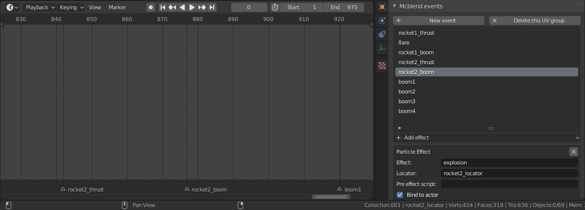

# Animating effects

The sound effects and particle effects are animated with use of events.
You can define events in _Mcblend events_ menu in
[scene properties](../gui_changes/#scene-properties). One event can contain
multiple particles and sound effects. The effects are not visible in preview
of the animation in Blender. They only add some information to exported
animation.

Effects can be attached to the animation by adding markers in the timeline with
the name of the event. You can trigger the same event multiple
times in the animation by adding multiple timeline markers with the same name.

Timeline markers that do not have a matching event name are ignored when
exporting the animation and serve the same purpose as any other timeline marker
in Blender.

A timeline with timeline markers for events:
