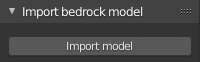
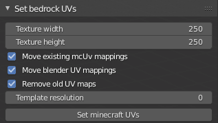
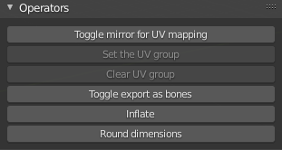
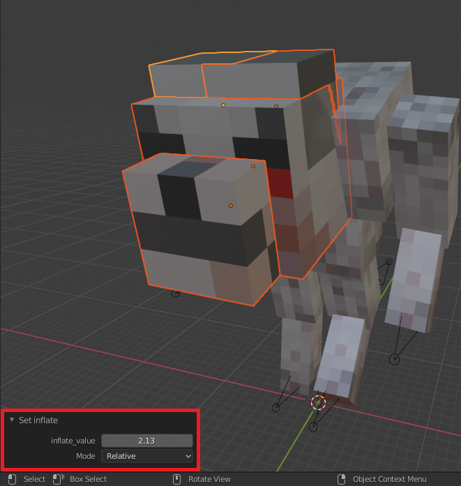

# Basic operators

All of the basic operators are in the sidebar.

## Importing models

This panel is used for importing bedrock models from JSON files.

__Usage__

1. Press the "Import model" button.
2. Set the import properties on the right side of the file explorer.
    - "Geometry name" lets you specify the name of the model that you want
      to import from the file. You can leave it blank to import the first
      model from the list. Don't add `geometry.` prefix to the model name
      (it's added automatically).
    - "Replace bones with empties" checkbox decides whether the model should
      be imported using empties to represent Minecraft bones (checked) or an
      armature and bones (unchecked, default value).
3. Find the model file in the file explorer and press import model to finalize
  the importing.

The import model operator can also be accessed via `File -> Import` menu.

## Exporting models

The "Export models" panel is used to export models. You can set the
name and visible model bounds here. Exported model will automatically add
the `geometry.` prefix to the name so you don't have to do that.

__Usage__

1. Select all of the objects that you want to export.
2. Insert the name of the model.
3. Press the "Export model" button.
4. Choose the output path in the file explorer window.

The export model operator can also be accessed via `File -> Export` menu.

## Exporting animations

Exporting animations is done with "Export bedrock animations" panel.

__Usage__

1. Create new animation with "New animation" button (some of the parts of
  panel won't be visible until you have an animations). You may have as
  many animation settings saved as you want and you can switch between them
  with "Select animation" dropdown menu.
2. Select the objects to export in the 3d viewport.
3. Fill in the form with the information about the animation.
  - **Name** - the name of the animation.
  - **Loop** - whether the animation should be looped.
  - **Current frame only** - instead of exporting animation exports the
    current frame as looped single frame pose animation.
  - **anim_time_update** - the content of this textfield is copied to
    "anim_time_update" property of the Minecraft animtion. If you leave it
    blank the the animation won't use the anim_time_update.
4. Press the "Export animation" button.

!!! note

    The time of the animation is determined by the time of animation
    that you can set in the timeline. The animations should always start
    at frame 1. Frame 0 should have the model in the default pose.

## UV-mapping

UV-mapping is performed via "Set bedrock UVs" panel. You can also use this
panel for generating textures.

__Usage__

To perform the UV-mapping fill in the form and press the "Set Minecraft
UVs" button.

- **Texture width** - the texture_width property of the Minecraft model.
- **Texture height** - the texture_height property of the Minecraft model.
- **Allow texture expanding** - whether the texture can be expanded if there
  is no space for UV-mapping.
- **Generate Texture** - whether the operator should generate a texture (
  the name of the created texture is always "template")
- **Template resolution** - Sets the resolution of the template texture. This
  value describes how many pixels on the image is represented by one
  texture_widht or texture_height unit in the model definition. The value 1
  gives the standard Minecraft texture resolution. Higher values can be used
  to create "HD textures".

You can adjust the UV-mapping using [UV-groups](../uv_groups/) to get best.

!!! note

    After the UV mapping, you can still go to the UV editor and move everything
    to your liking. This operator tries to arrange the UVs of the selected
    objects on the texture space using the basic non-per-face Minecraft
    UV-mapping. If you move the UV in such a way that it cannot be mapped
    in standard Minecraft UV-mapping way than mcblend will detect that
    and uses per-face UV mapping.

    Don't move individual vertices of the faces on the UV unless you know what
    you're doing. The faces on the UV must remain rectangles, or the UV of the
    exported model may have unexpected shapes.

## Modifying Mcblend properties

The "Operators" panel gives access to operators that modify various
properties used by Mcblend.

### Toggle mirror for UV mapping
Toggles the mirror property of selected
objects.

The mirror property affects the process of UV-mapping. Objects with
this property are mapped as if they had the Minecraft mirror property.
Using this operator doesn't remap the UV. If you want to change
the UV of the object, you must also use the operator from the
[Set bedrock UVs](#uv-mapping) panel to update the UVs.
### Set the UV group
Adds selected objects to one of the existing [UV-groups](../uv_groups).
### Clear the UV group
Removes selected objects from UV-groups.
### Toggle export as bones
Toggles the export bone property of selected objects.

Objects with this property are always exported as bones. Mcblend usually tries
to export most meshes as cubes and groups them together with some parent
object that becomes a bone. If you want to mark a certain cube as an
independent bone, you need to use this operator.

!!! note

    The best way of using Mcblend is to have one rig for the model and
    parenting the meshes to bones of that rig. This allows you to take the
    advantage of features like inverse kinematics and also creates a
    model in which it's really easy to distinguish which Blender object becames
    what in Minecraft model. Bones will be translated into Minecraft
    bones and meshes into cubes. If you add some empties without children
    they will become the locators.

### Inflate
Inflates the selected object using Minecraft inflate property.

Running this operator opens a panel in the bottom left corner of the 3D
viewport. You can use this panel to adjust the "inflate" value.

### Round dimensions
Rounds the dimensions of the object in such way that
they become integers in exported Minecraft model.
