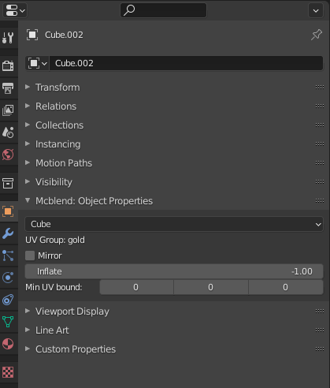

# GUI
Mcblend adds new elements to Blender GUI:

- _Mcblend_ tab on [sidebar](#sidebar),
- _Mcblend: UV-groups_ and _Mcblend: Animation Events_ tab in the
  [Scene Properties](#scene-properties),
- _Mcblend: Object Properties_ in the [Object Properties](#object-properties-mesh)
  when you have a mesh selected,
- _Mcblend: Model Properties_, _Mcblend: Render Controllers_ and
  _Mcblend: Animations_ in the [Object Properties](#object-properties-armature) when
  the active object is an armature.
- _Export bedrock Model_ and _Export Bedrock Animation_ in the export menu,
- _Import Bedrock Model_ in the import menu.

## Sidebar
The sidebar (the menu that you can open by pressing `N` button by default) 
gives access to some of the operators and has a panel which lets
you quckly import models of the entities from resource packs.

### Resurce Pack panel
The resource pack panel lets you connect a resource pack to a project. When
you have a resource pack connected to your project you can easily an entity
from a list and import all of its models (if it has multiple) and select
the texture variant and materials that you can use. The example on the sidebar
image (above) is more complicated than most of the models that you would 
normally import, in most cases Mcblend will be able to automatically detect
which model, material and texture should be used but in some cases it's
impossible to tell without analysing behavior of the entity when molang queries
are used. In these situations additional user input is required.

### Operators
#### UV-mapping panel
- **Fix model UV-mapping** -  operator used to fix invalid UV-mapping of the cubes 
  of the model. All faces of the cubes in the Minecraft model must
  be rectangular and have certain rotation. This operator ensures that this
  conditions are true. It's particularly useful when you get an error message
  which says that certain object has invalid UV-mapping and is impossible to
  export. The operator fixes all of the cubes of the model and can be used
  only when the active object is an armature.
- **Set the UV group** - adds selected objects to one of the existing
  [UV-groups](../uv_groups). This operator can be used when at least one
  mesh is selected and at least one UV group has been created in your project.
- **Clear UV group** - oposite to "Set the UV group". It removes the UV group
  from the selected objects.

#### Mesh Transformations panel
- **Inflate** - Inflates the selected object using Minecraft inflate property.
  Running this operator opens a panel in the bottom left corner of the 3D
  viewport. You can use this panel to adjust the "inflate" value.
  
- **Round dimensions** -Rounds the dimensions of the object in such way that
  they become integers in exported Minecraft model.
- **Separate and align cubes** - Separate cubes can detect cubes grouped in a
  single mesh and separate them into multiple objects. Unlike the vanilla
  Blender operator (*Mesh -> Separate*), the *Separate cubes* operator
  from Mcblend is designed for working with cuboids and can detect their
  rotations. This is important because meshes in Mcblend must be aligned with
  the rotations of the objects that store them in order to make Mcblend work
  properly. Additionally if you happen to have a mesh with single cube rotated
  in edit mode (mesh not aligned to object rotation), you can use this operator
  to fix the problem. The operator won't create new objects if there is only
  one cube in the mesh but it will fix the rotation problem.
  Images below show the difference between applying *Separate cubes* and
  *Mesh -> Separate* operators:
  *Before separating cubes*
  
  *Objects separated with Mcblend*
  
  *Objects separated using default Blender operator*
  

- **Prepare physics simulation** - this button automatically creates objects
  which can be used for physics simulation. The simulation starts one frame after
  the selected frame. It adds ragdoll effect to the model. Newly created
  objects are added into 3 separate new collections: Rigid Body (a group
  with rigid body objects with the same shape as the original model), Rigid
  Body Constraints (a group of empties with rigid body constraints that
  connect parts of the simulated objects together) and Bone Parents (a group
  of objects which follow the rigid body and make the original model follow
  the simulation).
  

## Scene properties

Scene properties tab has two new panels:

- _Mcblend: UV-groups_ - used for [creating](../uv_groups) and [customizing](../texture_customization) UV-groups.
- _Mcblend: Animation Events_ - used for adding events for creating [sound- and particle-effects animations](../animating_effects).

## Object properties (mesh)
This is the panel that you cane see when you open object properties of a mesh.

**Mesh type (dropdown list)** - *Cube* or *Poly mesh*. Decides if the object
should be exported as a cube or polymesh. Objects with non-cuboid shapes must
be polymesh type or you won't be able to export them.

!!! note

    Polymesh models are still experimental Minecraft feature and they could
    even be removed from Minecraft. Experimental features are not allowed on
    marketplace so keep that in mind if you're making a map for
    marketplace.

**UV Group (textfield)** - displays the [UV-group](../uv_groups) name of the
selected object.

**Mirror** - the mirror property is used only during the
UV-mapping. It affects the mapping of the faces of the object in a same way as
Minecraft mirror property of a cube.

**Inflate** - stores the Minecraft inflate property value of the cube.

!!! note

    Editing the Inflate value through this panel does not change the dimensions
    of the object, but it does change the inflate value in the exported object.
    If you want to inflate/deflate the object you should use the
    inflate operator from the sidebar.

**Min UV bound** - this property is used during UV-mapping. It defines the
minimal space on the texture used for a cube. If cube has width, height
or depth lower than one unit of length, this property can be used to make sure
that every face will gett some space on the texture. Normally in this case a
the size of the cube would be rounded down to 0 during UV-mapping and some of
the faces of the cube wouldn't get any space on the texture. 

## Object properties (armature)
This is the panel that you can see when you open object properties of an
armature.

**Mcblend: Model properties** - this panel has some of the basic properties of
the minecraft model (like visible bounds widht and height) and someproperties
used for texture generation.

- *Allow texture expanding* - allows changing the texture width and height during
UV-mapping.
- *Generate Texture* - generates template texture during UV-mapping
(UV-mapping without this option sellected will change the UV of the model but
won't generate any texture file).
- *Template resolution* defines the size of the texture. The real resolution of
the generated texture image is equal to texture width and hight multiplied
by texture resolution.
- *Set minecraft UV* button - generates the UV map and texture of the model
  based on the setting from the properties above.

To perform the UV-mapping fill in the form and press the "Set Minecraft
UVs" button.

!!! note

    After the UV mapping, you can still go to the UV editor and move everything
    to your liking. This operator tries to arrange the UVs of the selected
    objects on the texture space using the basic non-per-face Minecraft
    UV-mapping. If you move the UV in such a way that it cannot be mapped
    in standard Minecraft UV-mapping way than mcblend will detect that
    and uses per-face UV mapping.

    Don't move individual vertices of the faces on the UV unless you know what
    you're doing. The faces on the UV must remain rectangles, or the UV of the
    exported model may have unexpected shapes.

**Mcblend: Render Controllers**

Tihs panel lets you quickly create materials for the model which will look
very similar to models in Minecraft. You can add multiple render controllers
to the model and in every render controller you can select single texture and
multiple materials assigned to the model by name patterns. When you finish
setting up the render controller you can use the "Apply materials" button to
automatically create the materials for preview in blender. If you add multiple
textures and render controllers to your model they'll be stacked on top of each
other in a same way as in Minecraft.

**Mcblend: Animations**

The animations panel lets you quickly switch between animations. The animations
in Mcblend are connected to NLA tracks of the armature. Switching the animation
in the Animations menu will switch the active NLA tracks.

- *New animation* - creates new animation. You can't use this operator while
  editing an action of the armature. If you want to create a new action you
  need to stash the action first.
- *Remove animation* - Removes currently active animation.
- *Select animation (dropdown list)* - Lets you select one of the previously
  created animations.
- *Name* - Sets the name of the animation.
- *Skip rest poses* - During exporting the animation with this checkbox
  selected will skip adding unnecessary frames which don't affect the movements
  of the models. In most cases it's recommended to use this option.
- *Export as pose* - Instead of exporting animation the exporter will export
  a single frame (a pose of the model).
- *Loop* - this property is the same as the loop property from Minecraft
  animation files. There are three options "true", "false" and
  "hold_on_last_frame"
- *Anim Time Update* - this property is exactly the same as the
  anim_time_update property from Minecraft animation files. You should either
  leave it empty (if you don't want to have "anim_time_update" in your
  animation) or put molang expression in it. It doesn't affect the animation
  in Mcblend. It only changes a single property of the exported file.
- *Frame start* - the first frame of the animation.
- *Frame end* - the last frame of the animation.
