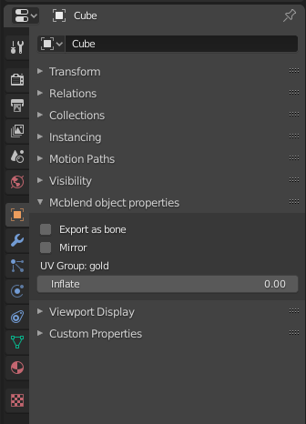

# GUI Changes
Mcblend adds new panels to Blender GUI:

- _Mcblend_ tab on [sidebar](#sidebar),
- _Mcblend UV groups_ tab in the [Scene Properties](#scene-properties),
- _Mcblend object properties_ in the [Object Properties](#object-properties),
- _Mcblend: Export model_ and _Mcblend: Export animation_ in
  the export menu,
- _Mcblend: Import model_ in the import menu.

## Sidebar
The sidebar gives access to most of the Mcblend functionality. It contains 5
panels:

- [Export bedrock animation](../basic_operators/#exporting-animations),
- [Export bedrock model](../basic_operators/#exporting-models),
- [Set bedrock UVs](../basic_operators/#uv-mapping),
- [Operators](../basic_operators/#modifying-mcblend-properties),
- [Import bedrock model](../basic_operators/#importing-models).

## Scene properties

Scene properties tab has new panel called _Mcblend UV groups_. It is used for
[creating](../uv_groups) and [customizing](../texture_customization) UV-groups.

## Object properties

Object properties tab has new panel - _Mcblend object properties_.
It lets you view and edit
[custom object properties](../basic_operators/#modifying-mcblend-properties)
used by Mcblend.

!!! note

    Editing the Inflate value through this panel does not change the dimensions
    of the object, but it does change the inflate value in the exported object.
    If you want to inflate/deflate the object you should use the
    inflate operator from the sidebar.