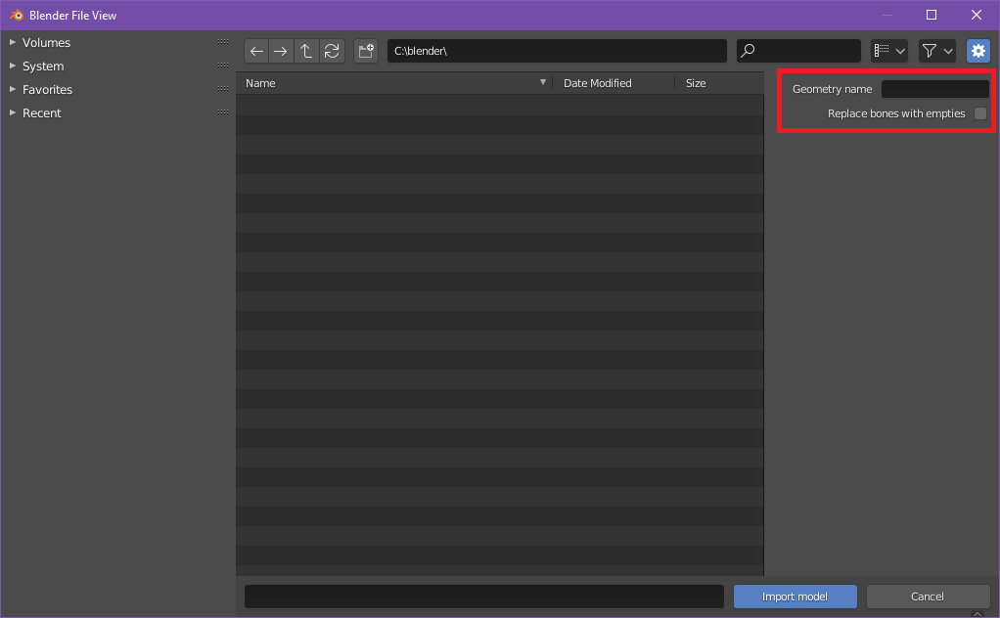
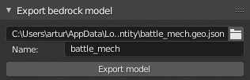
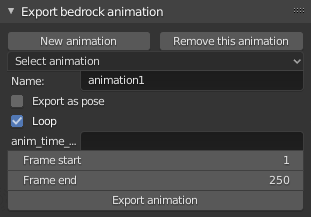

# Importing and exporting files

## Importing models

1. Go to `File -> Import -> Import Bedrock Model`
2. Set the import properties on the right side of the file explorer.
    - "Geometry name" lets you specify the name of the model that you want
      to import from the file. You can leave it blank to import the first
      model from the list. Don't add the `geometry.` prefix to the model name
      (it's added automatically).
3. Find the model file in the file explorer and press "Import model" to finalize
  the importing.

!!! Note

    Alternatively you can use the [resource pack panel](/mcblend/gui/3d_viewport_sidebar/#resurce-pack-panel)
    to import models from Minecraft resource packs.

## Exporting models

The "Export models" panel is used to export models. You can set the
name and visible model bounds here. The exported model will automatically add
the `geometry.` prefix to the name so you don't have to do that.

1. Select the armature which represents your model.
2. In the Object Properties of the armature you'll be able to change some settings
  related to exporting. 
3. When you finish adjusting the model settings, go to
  `File -> Export -> Export Bedrock Model`
4. Choose the output path in the file explorer window.

## Exporting animations

!!! note

    Mcblend exports animations using key frames. Molang is not supported.
    
    Blender lets you implement various dependencies between animated objects
    with constraints and rigging. This means that animating one object can
    affect the movement of another object even though the second object doesn't have
    any key frames. That is why the key frames in Blender animations aren't
    directly translated to key frames in Minecraft animations. Mcblend collects
    the time stamps of every keyframe of every bone of the armature and goes
    through that list looking for movements. Every movement of every bone
    between two frames is saved to the exported file.

    The keyframes from Non-Linear Animations (NLA) are also supported can also
    be used by Mcblend to detect the movements.

1. Enter Object Mode and select the armature with your model
2. In Object Properties find the `Mcblend: Animation` panel. Press "New animation"
   or select the animation you want to export, using the `Select animation`
   dropdown list.
3. Create your animation and stash the actions of the armature as the NLA
   tracks. You can combine multiple tracks into one animation. Mcblend remembers
   which NLA tracks are connected to which NLA tracks and changes the active
   tracks when you switch the animation.
4. In the `Mcblend: Animation` panel you can edit the fields with the information
   about the animation to configure it to your preference.
    - **Name** - The name of the animation.
    - **Skip rest poses** - Whether the bones in rest poses should be exported
        as a part of animation. A rest pose is a pose with the default location,
        rotation and scale. This setting typically significantly reduces the
        size of the exported animation.
    - **Export as pose** - Exports the current frame as a looped animation with
        a pose, instead of exporting a full animation.
    - **Loop** - Whether the animation should be looped.
    - **Anim Time Update** - The content of this text field is copied to the
      "anim_time_update" property of the Minecraft animation. If you leave it
      blank, then the animation won't use that property.
4. Open `File -> Export -> Export Bedrock Animation`.

!!! note

    Mcblend uses frame 0 to detect the rest pose of the model. Every movement
    in the animation is relative to the rest pose. If you're exporting the
    model and the animation, make sure that the animation doesn't
    change the pose of the model on frame 0 or you may get some unexpected
    results.
