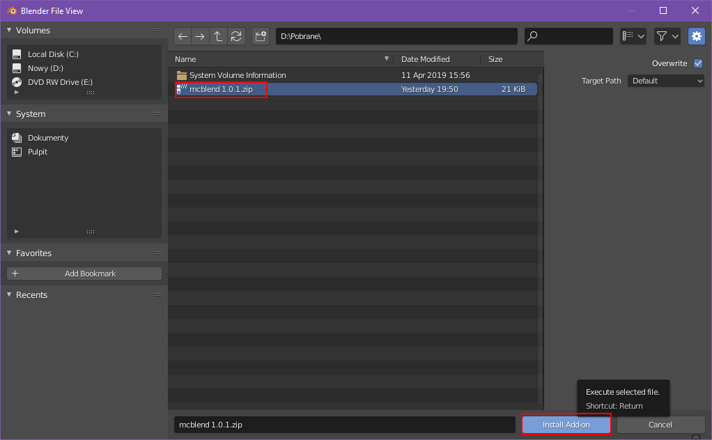

# Overview
A Blender addon for creating and animating Minecraft Bedrock Edition models.

## Features
- Importing and exporting Minecraft Bedrock Edition polymesh and cube based models
- Generating UV-maps and textures for Minecraft models
- Exporting animations
- Exporting poses
- The animated models can use armatures and constraints to make animating easier. Mcblend can detect parts moved by the constraints and add that to Minecraft animations even though Minecraft don't have features like that.
- Adding physics simulations to the model with a single press of a button

## Planned features
The improvements planned for this Blender plugin are often listed as
["issues"](https://github.com/Nusiq/mcblend/issues) on the Github project page.

## Installation
1. Download and install [Blender](https://www.blender.org/download/).
2. Download the latest version (zip file) from the project page on Github:
[https://github.com/Nusiq/mcblend/releases](https://github.com/Nusiq/mcblend/releases)
3. In Blender go to: `Edit -> Preferences -> Add-ons -> Install...`

4. Select the zip file in the file explorer.

5. Search for "Mcblend" in Add-ons and select the check box to enable the add-on

## Updating
Currently there is no system for updating Mcblend. If you want to update than you
must uninstall the old version of the addon and than install the new one.

## Which version should I install
### Pre-release vs Latest release
The top first two releases at the top of the list are usually *Pre-release*
and *Latest release*. The Pre-release versions are used to quickly deploy a new version
of Mcblend before updating the user manual. This means that Pre-release versions usually
have more features and some additional bug-fixes but they are not documented. When
this user manual is updated the *Pre-release* is changed to *Latest release*. Sometimes
shortly after chainging the pre-release status to normal release there is no pre-release
on the list.
### Versioning system
The Mcblend version numbers are created with 3 dot-separated numbers: A.B.C

- A - Compatibility breaking change (some change in the code which may make some
of the data from the project to be lost in case of upgrading from older version of
Mcblend)
- B - New features
- C - Bug fixes

Changing A resets B and C. Changing B resets C.
