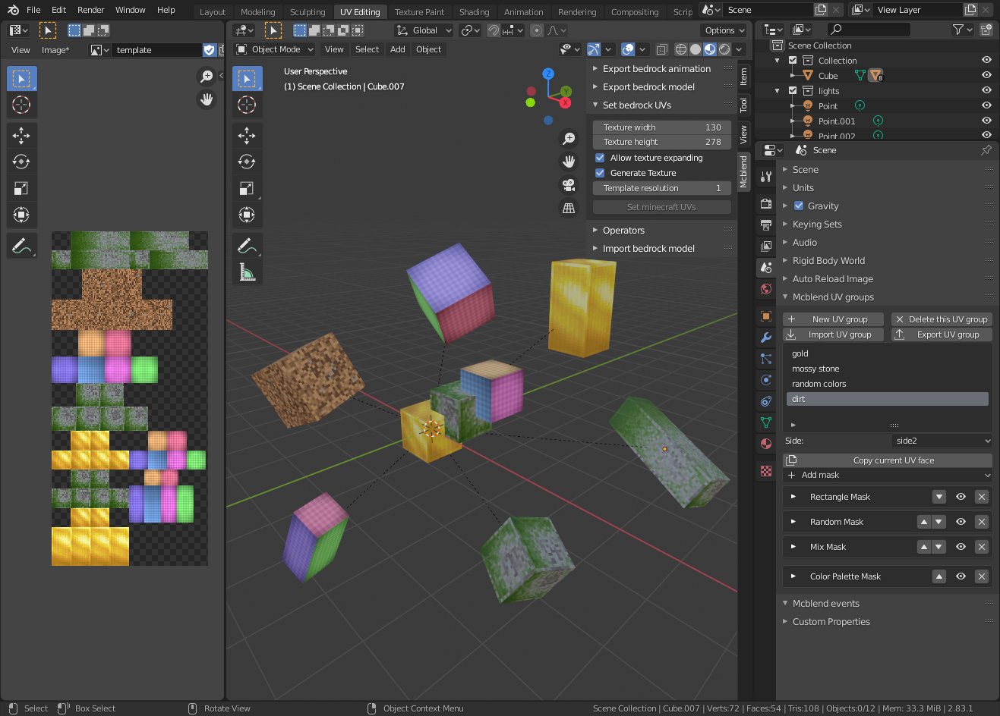
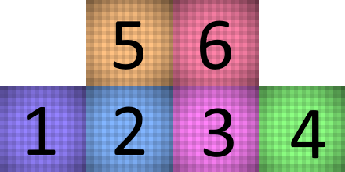
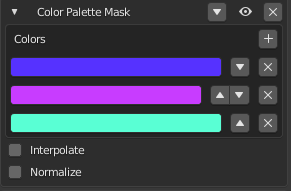
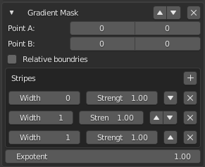
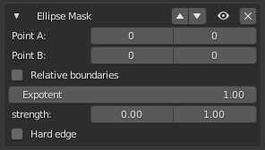
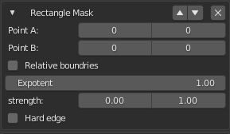
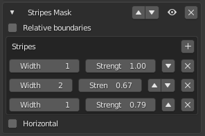
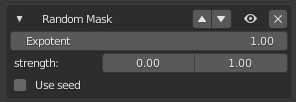
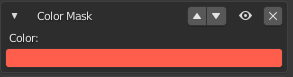
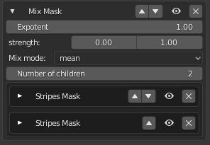

# Texture generator customization

You can customize the appearance of a UV-group by applying masks to its faces
in new custom panel in [Scene Properties](../gui/#scene-properties).

Masks are filters that are applied to the texture when it is generated.
Each UV-group has 6 faces. You can switch between faces to edit with the
"Side:" dropdown menu. The image below shows how the names of the
sides (side1-6) are correlated to their placement on the texture.

New masks are added with the "Add mask" dropdown menu. There are 8 different types
of masks.

!!! note

    All masks have an eye icon in the upper right corner that can be used to
    temporarily disable / enable the mask.

## Color Palette Mask

This mask takes the grayscale image as an input and maps its brightness values
to a color image with a palette defined as a list of colors.

Properties:

- Colors - List of colors in the palette
- Interpolate - Whether there should be a smooth transition between the colors
    on the palette.
- Normalize - Normalizes the input values so that the entire palette is
    used.

!!! note

    If the input image is not grayscale then it gets converted to grayscale
    before applying the mask.

!!! note

    The color palette mask is the only mask which can't be used inside the Mix
    Mask. If you put this mask into mix mask it will have no effect.

## Gradient Mask

The Gradient mask creates a grayscale gradient with stripes of varying darkness
and width. The direction in which the stripes are drawn is defined with two
points on the texture. The grayscale image is then multiplied by the input image.

Properties:

- Point A - The starting point of drawing gradient stripes.
- Point B - The end point of drawing gradient stripes.
- Relative boundaries - Whether points A and B should be passed as absolute
    values (number of pixels from the lower left corner of the texture) or as a
    fraction of the texture size (0.0 lower left corner, 1.0 upper right corner).
    The absolute values can be negative, meaning they represent the number of
    pixels from the top right corner (starting at -1).
- Stripes - The list of stripes in the gradient, with their colors (strengths) and
    their widths. The widths define their placement on a line between points
    A and B, so in most cases the width of the first stripe is 0, which means
    that this stripe should be drawn at Point A.
- Exponent - The filter image is raised to the power of this value before it
    is multiplied by the image.
## Ellipse Mask

The Ellipse mask creates a grayscale image of an ellipse drawn between Point A and
Point B. The grayscale image is then multiplied by the input image.

Properties:

- Point A and B - Boundaries of the ellipse.
- Relative boundaries - Whether points A and B should be passed as absolute
    values (number of pixels from the lower left corner of the texture) or as a
    fraction of the texture size (0.0 lower left corner, 1.0 upper right corner).
    The absolute values can be negative, meaning they represent the number of
    pixels from the top right corner (starting at -1).
- Exponent - The filter image is raised to the power of this value before it
    is multiplied by the image.
- Strength - The min and max values of brightness of the created filter image.
- Hard edge - Whether the ellipse should have hard edges or the brightness
    of the inner part of the ellipse should be smoothly interpolated towards 
    the edges of the image.

## Rectangle Mask

The Rectangle mask creates a grayscale image of a rectangle between Point A and
Point B. The grayscale image is then multiplied by the input image.

Properties:

- Point A and B - Opposite corners of the rectangle.
- Relative boundaries - Whether points A and B should be passed as absolute
    values (number of pixels from the lower left corner of the texture) or as a
    fraction of the texture size (0.0 lower left corner, 1.0 upper right corner).
    The absolute values can be negative, meaning they represent the number of
    pixels from the top right corner (starting at -1).
- Exponent - The filter image is raised to the power of this value before it
    is multiplied by the image.
- Strength - The min and max values of brightness of the created filter image.
- Hard edge - Whether the rectangle should have hard edges or the brightness
    of the inner part of the rectangle should be smoothly interpolated towards 
    the edges of the image.

## Stripes Mask

The Stripes mask creates a grayscale image with repeating stripes of certain
width and brightness. The grayscale image is then multiplied by the input
image.

Properties:

- Relative boundaries - Whether the width of the stripes is expressed as a
    fraction of the image width / height.
- Stripes - The list of the stripes, their width and their brightness.
- Horizontal - Whether the stripes should be vertical or horizontal.

## Random Mask

The Random mask creates a grayscale image with randomly bright pixels. The
grayscale image is then multiplied by the input image.

- Exponent - The filter image is raised to the power of this value before it
    is multiplied by the image.
- Strength - The min and max brightness values of the pixels on the filter
    image.
- Use seed - Allows you to set the seed for the color randomization.

## Color Mask

The Color mask multiplies the input mask by a color.

## Mix Mask

The Mix mask lets you mix multiple masks in different ways than just default
multiplication. 

Properties:

- Exponent - The filter image is raised to the power of this value before it
    is multiplied by the image.
- Strength - The min and max values of the brightness of returned filter image.
    The filter image brightness values are mapped to fit on the scale between
    values defined by "strength"
- Mix mode - How to mix filter images produced by other masks. There are 4
    options: min, max, mean and median.
- Number of children - Number of mixed masks.

!!! note

    Mix mask ignores the color palette masks, since the color palette masks do
    not create a filter image (they just alter the image from the input).