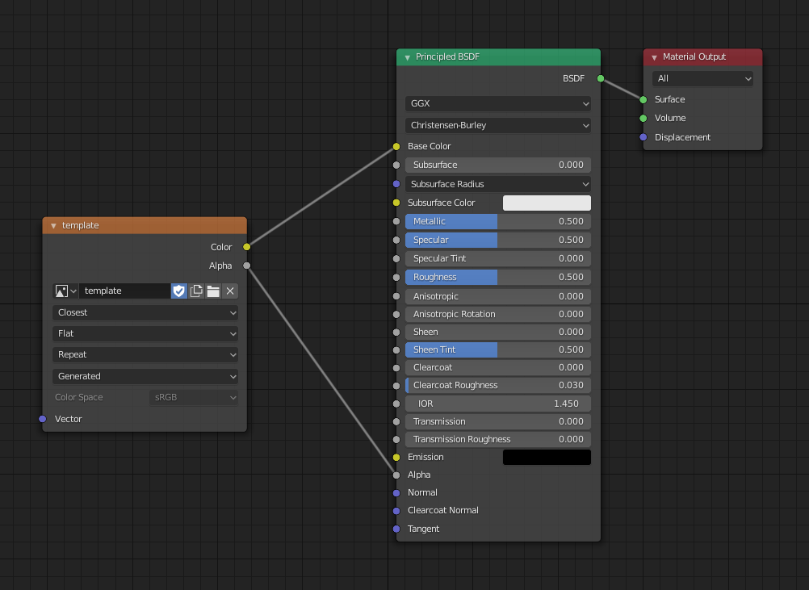

# Tips and tricks
This is a list of tips and tricks related to Mcbled. Some of them are related
to the addon and some of them explain some basics of using Blender which can be
useful for working with Mcblend.

## Matching framerate
By default blender uses 24FPS framerate. Minecraft uses seconds to define
the timestamps of keyframes in animation. It's good to change the framerate setting
into something that divides 1 second period into something nice - for example
(25FPS or 20FPS). 1/24 is 0.0416666 but 1/25 is 0.04 which looks way better in the
animation file.

You can find the framerate setting in `Output Properties -> Frame Rate`.

## World unit scale
By default 1 meter in Blender is equal to one block in Minecraft. One
Minecraft meter is 16 units of length of the model. You might want to
measure the size of the model using these units instead of meters. You can
go to `Scene properties -> Unit scale` to scale the units used in blender.
Changing the value of this property to 16 will cause that one length unit in
Blender model will be equal to one length unit of your model.

## Creating materials
Currently the addon doesn't create materials for your model during UV mapping
and generating textures. When you create your UV map and texture template, it is
not visible on your model. If you want to make the texture visible you have to
create new material in shader editor and assign it to every object in your
model.

1. Generate texture template using the [Set bedrock UV panel](../gui).
2. Go to the shading tab and create new material. Based on the image below:

    

3. Enable the transparency in material properties.

    

4. Assign the material to other objects in your model.
    Select all of your objects and make sure that the object that uses your
    material is active. Go to `Material Properties` right click on the material
    and select "Copy to selected".
