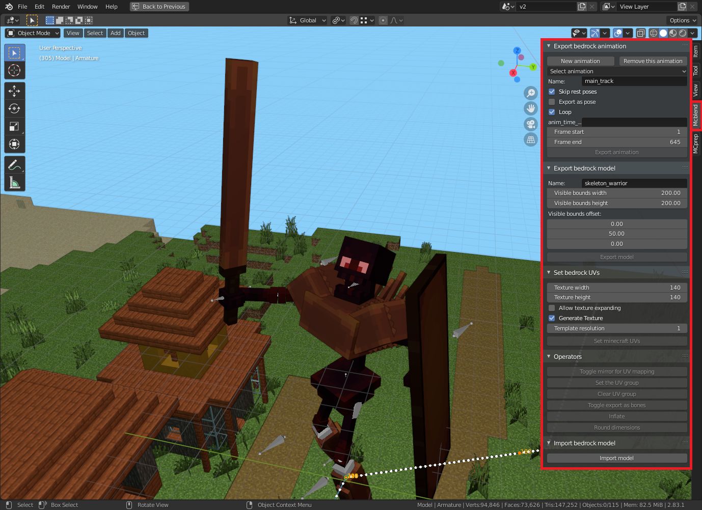
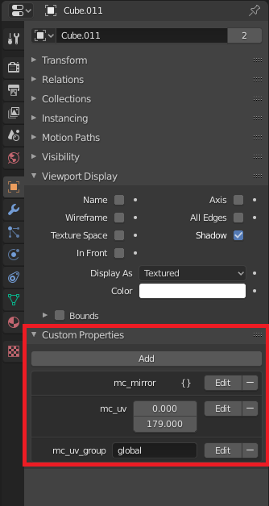

# Basics
## GUI

After installation and enabling the add-on there should be an additional tab
called "Mcblend" on the right side of 3d-viewport (default key to open/close
the sidebar in Blender is N). Opening this tab reveals panels which are used
to accesss most of the functionallity of the addon. Every panel is described
further in the user manual in [panels](../panels/) section.

Additionally you can find some new options in `File -> Export` menu.

## Limitations
Minecraft bedrock edition modles support only cuboids.You cannont use other
shapes for your model. Mcblend uses bounding boxes to create cuboids for
exported model.

!!! note

    The best way to avoid problems with invalid meshes is to always use
    blenders "Object mode" for editing the model. Additionally you can enable
    drawing the bounding box in object
    `Object properties -> Viewport display -> Bounds`

## Custom properties
Mcblend uses custom object properties to store some data about minecraft model:

- `mc_uv_group` - used to group cubes with same width, depth and height to assign
  same uv-mapping to them.
- `mc_uv` - U and V value of mcmodel uv-mapping.
- `mc_is_bone` - if exists it marks an object as a minecraft bone.
- `mc_inflate` - the inflate value of cube in minecraft model.

You can view the these porperties in `Object properties -> Custom properties`

