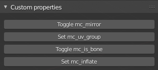
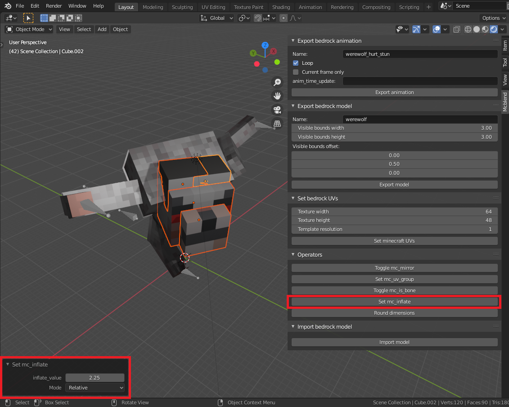

# Panels
## Custom properties panel

This panel adds easy access for managing some of the custom properties used by
the plugin.

__Usage__

- **Toggles mc_mirror** - Toggles `mc_mirror` property for selected object.
  Objects that have `mc_mirror` property create cubes with mirrored UV.
- **Set mc_uv_group** - Groups selected object together which affects the
  UV-mapping. Object assigned to the same `mc_uv_group` is mapped to the same
  spot on the texture if they have the same dimensions.
- **Toggle mc_is_bone** - Toggles `mc_is_bone` property for selected objects.
  object with this property are exported as bones in the Minecraft model.
- **Set mc_inflate** - Set the `mc_inflate` vale for selected objects. This is
  equivalent to setting the inflate value in the Minecraft model. Running this
  operator opens a panel in the bottom left corner of the 3D viewport. You
  can use this panel to adjust the "inflate" value.

- **Round dimensions** - Rounds the dimensions of the object to integers.
  This operator is useful for aviding problems with UV-mapping.

## Set bedrock UVs panel

This panel is used for creating UV-mapping for the model and generating
template textures.

__Usage__

By default all of the cubes in the model have the [0, 0] UV-mapping.
The UV mapping values of each object are stored in `mc_uv` custom property.

To perform the UV-mapping fill in the form and press "Set Minecraft
UVs"

- **Texture width** - the texture width property of the Minecraft model.
- **Texture height** - the texture height property of the Minecraft model.
  If you sent this property to 0 the texture height will be selected
  automatically to fit all textures as tight as possible.
- **Move existing mcUv mappings** - this checkbox decides if the cubes that
  already have assigned UV-mapping values can be moved.
- **Move blender UV mappings** - this checkbox decides if blender objects
  should have their UV-mapping moved to match the Minecraft model.
- **Remove old UV maps** - objects in blender can have multiple UV maps but
  only one of them is visible. Ticking this box causes that old UV-maps are
  removed when the new one is created.
- **Template resolution** - Sets the resolution of the template texture. If you
  set this to 0 then the template texture won't be created. This value
  describes how many pixels on the image is represented by one texture_widht or
  texture_height unit in the model definition. The value 1 gives the standard
  Minecraft texture resolution. Higher values can be used to create "HD"
  textures.
- **Set Minecraft UVs** button runs the operator which plans the UV-mapping and
  optionally creates the template texture.

## Export bedrock model panel

This panel is used for exporting the models.

__Usage__

1. Select all of the objects that you want to export.
2. Insert the name of the model.
3. Press the "Export model" button.

## Export bedrock animation panel

This panel is used for exporting animations.

__Usage__

1. Select all of the objects to export.
3. Insert the name of the animation.
4. If you want to loop the animation select the "loop" checkbox.
5. If you want to use the `anim_time_update` property of Minecraft animation
  insert its value to a proper text field. You can leave it blank if you don't
  want to use it.
6. Press the "Export animation" button.

## Import bedrock model panel

This panel is used for importing bedrock models from JSON files.

__Usage__

Press the button and use file explorer to find the model you want to import.
There is additional property in the file explorer which allows you to specify
the name of the geometry you want to import. Only geometries with `.geometry`
prefix in the name are supported. You don't have to write the prefix (it's
added automatically to the name). If you leave this field empty only the
first model from the list of geometries will be imported.

