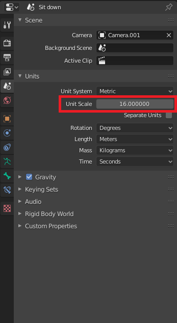
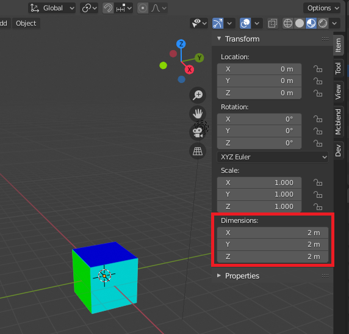
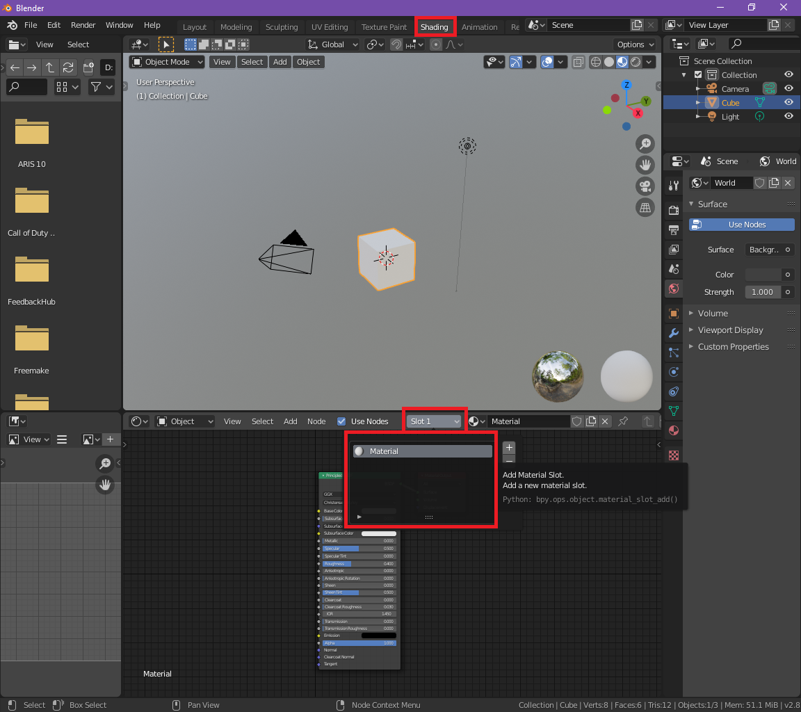
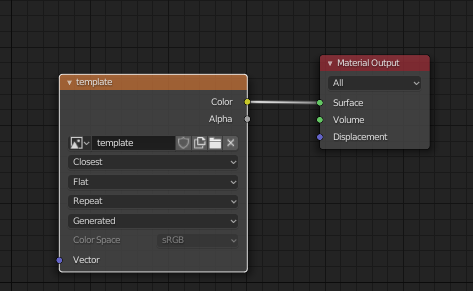
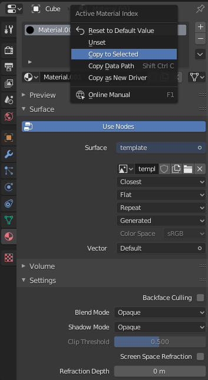
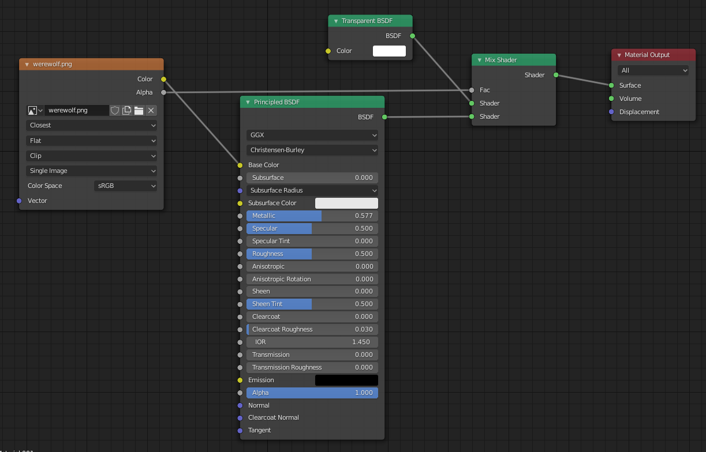
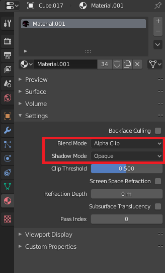
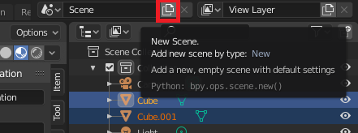

# Tips and tricks
This is a list of tips and tricks related to Mcbled. Some of them are related
to the addon and some of them explain some basics of using blender which can be
useful for working with Mcblend.

## Framerate
By default blender uses 24FPS framerate. Minecraft uses seconds to define
the timestamps of keyframes in animation. It's good to change the framerate setting
into something that divides 1 second period into something nice - for example
(25FPS or 20FPS). 1/24 is 0.0416666 but 1/25 is 0.04 which looks way better in the
animation file.

You can find the framerate setting in `Output Properties -> Frame Rate`.

## World unit scale
By default 1m in your model is equal to one block in Minecraft. One meter
Minecraft model is 16 pixels on the texture of the model. You might want to
measure the size in pixels instead of meters. You can change the setting that
you can find under `Scene properties -> Unit scale`. Changing the value
of this property to 16 will cause that one meter of your blender model will be
converted into 1 pixel in Minecraft.

This setting is really useful because when you set it you can use the `Item`
panel to track the dimensions of the object and make sure it has integer
dimensions (non-integer dimensions may cause problems with UV-mapping).

!!! Note

    If an object uses the inflate property the "Dimensions" panel doesn't show
    it's real Minecraft dimensions. In this case, the panel can't be used to
    check if the dimensions use integer values only.

## Creating material for the Minecraft model
Currently the addon doesn't create materials for your model during UV mapping
and generating textures. When you create your UV map and texture template, it is
not visible on your model. If you want to make the texture visible you have to
create new material in shader editor and assign it to every object in your
model.

**1.** Generate texture template using the [Set bedrock UV panel](../panels/).
Remember to change the "Template resolution" setting a to value greater than
0 (1 is the standard Minecraft texture resolution).

**2.** Go to the shading tab and create new material.

**3.** Remove the `Principled BSDF` node and replace it with `Image Texture` node
(`SHIFT + A` and search "Image Texture"). Connect the node to material output
just like on the image. Set interpolation setting to "Closest", the third
setting to "Clip"  and choose your to texture under the image setting.

**4.** You don't have to create new material for every object. You can
assign the material you use to other objects in your model. Select all of your
objects and make sure that the object that uses your material is active.
Go to `Material Properties` right click on the material and select "Copy to
selected".

If you want to have a material that supports transparency than the nodes in
the shading editor will need to have more complicated layout:

You will also have to enable the transparency settings in the material configuration:

## Multiple animations
If you want to have multiple animations in your project you can copy the scene
with your finished model and animate it there. Every scene has its
animation length and Mcblend settings (like the name of the animation). You can
create copies of a scene by pressing the new scene button (top right corner on
default GUI layout).

You might have noticed that the names of your objects on the copied scene
are not the same as the names of the originals. This is because they are
different objects and every object has a unique name in Blender. Blender adds
indexes to objects that try to use occupied names. Don't worry about it. Mcblend
ignores everything after the first dot symbol in the object name. Your animations
will be generated with the shortened names.

## Renaming objects
There is a consequence of ignoring parts of the names of the objects in blender
object while exporting them to Minecraft format. This feature can cause that
the names are not unique anymore. For example `Cube.001` and `Cube.002` are the
same name for Mcblend. In case of name collision Mcblend shows a warning which
tells you which object should be renamed.

Usually, you should have descriptive unique names for everything but if your
still want to have the automatically generated names with indices you can
easily remove the dot symbol from names of the selected objects by using the
"search and replace" function which can be accessed by
pressing `CTRL + F2` (default key-bind setting).
